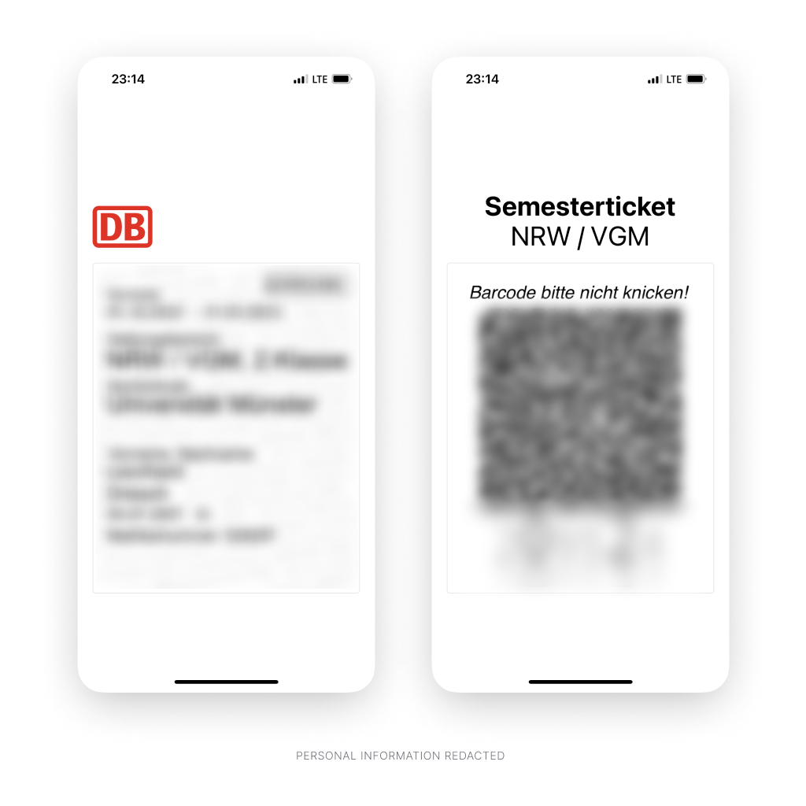

  

<h1 align="center">
  Ticket
</h1>

<b>
  App that scans and stores your semester ticket.
</b>

  

This is a simple PWA that can save your semester ticket and crop out the
relevant parts so it is easier to show to conductors.

It is available offline and does not upload your ticket to a server.

 

## Screenshots

 

## Development

1. **Requirements**

   You should have an LTS version of [Node.js](https://nodejs.org/en/)
   installed.

2. **Install the dependencies**

   Run `npm install` to install all neccesary packages.

3. **Run the application**

   Start the development server by running `npm run dev`.
